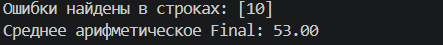
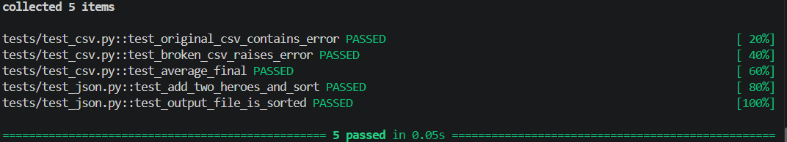
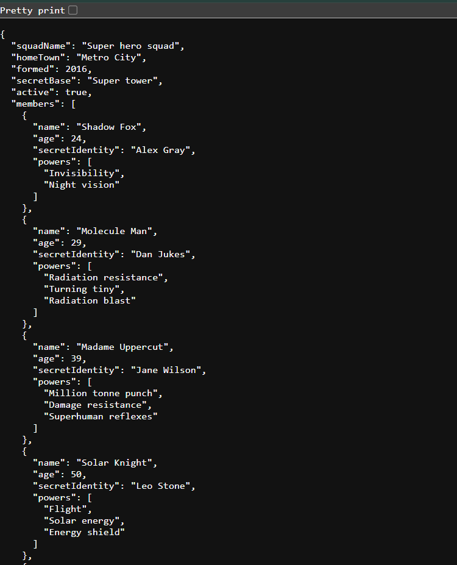
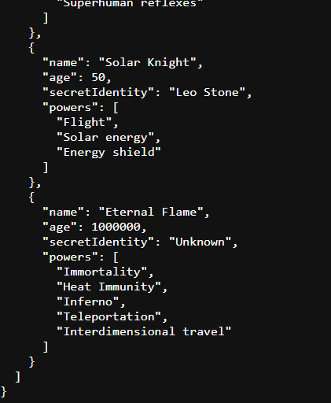
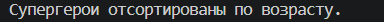

# КТ — тестирование файлов

## CSV

Выполнен расчёт среднего арифметического оценок из столбца `Final`.
При проверке исходного CSV найдена ошибка в строке 10. После исправления среднее арифметическое `Final` составило `53.00`.

## Проверка через pytest

Проверка выполнена через `pytest -v`. Все 5 тестов пройдены успешно.

## JSON

В `SuperHero.json` добавлены 2 новых супергероя. Все супергерои отсортированы по возрасту. Результат сохранён в `superhero_new.json`.

Результат запуска программы:

